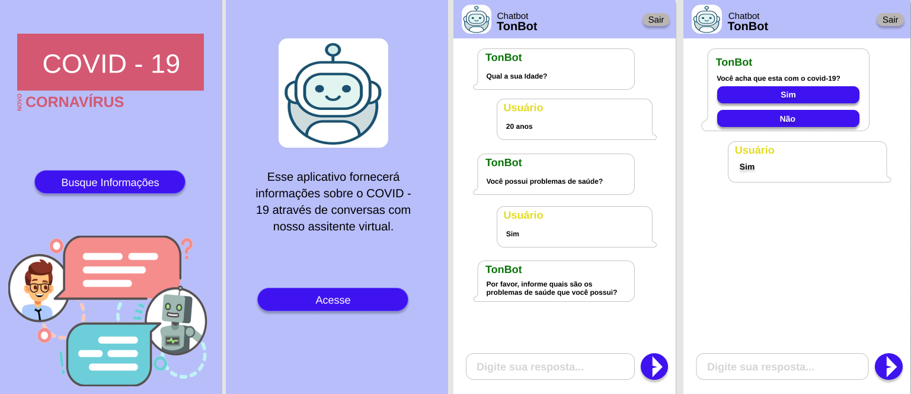
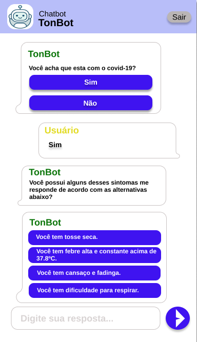

* Projeto Front-End Boot Covid-19
  * Design - Ferramenta Figma

> Trabalho acadêmico da faculdade

> Desenvolvido por Ericton Felicidade de Brito

Algumas telas desenvolvidas:

[Clique aqui](https://www.figma.com/proto/77j5RPMjJ1HKdtl2iM7Q5k/ChatBot-Ericton?node-id=2%3A173&scaling=scale-down) para visualizar o protótipo.
